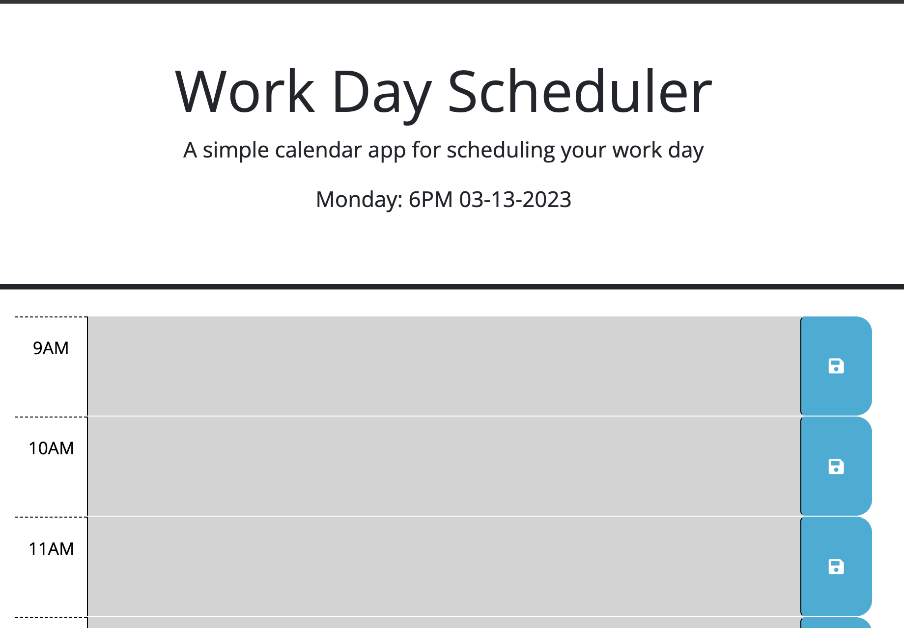

# Calender Application
The assigment is to create a calander for user to input hours and days from it. 
Use the starter code. 
A calander with todays date on it and all the hours of the day with the ability to chose, select and input scheduel.

## Progress
Copied the REPO and cloned. 
created the files needed, must build out the bones of html at least 
using jquery to target id and add the current date.
used the button to save what is in the text box
must now create a if else statement for three conditions, green when it matches the date and time, grey whhen the time past and green if the time has yet to come (maybe use === and < or >)
have created the if statements but nothing is changing
also reformatter the dayjs display.
created a for-loop for the buttons (learning more about arrays)

### Links and Screenshots
Github: https://github.com/escotoj/CalendarApp
Deployed App: https://escotoj.github.io/CalendarApp/ 

